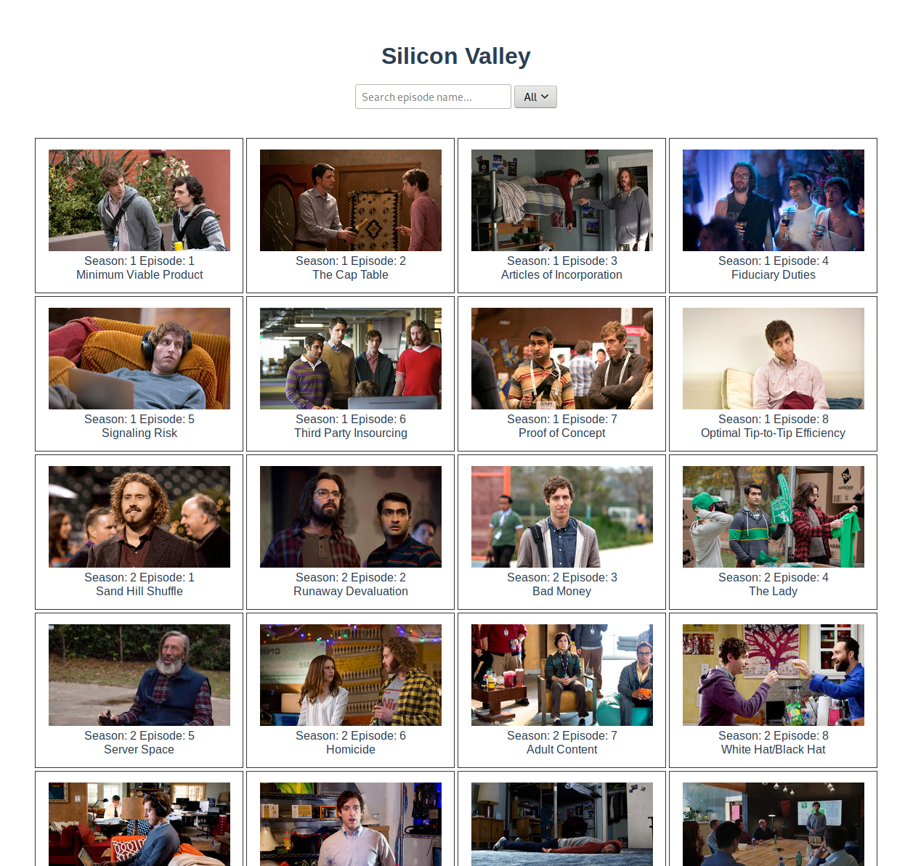

# Silicon Valley

Vue/Node app to fetch and display episodes from the tv show Silicon Valley.

To run:

run ```npm install``` in both the client and server directories

run ```npm start``` in both the client and server directories

open ```http://localhost:8080/#/silicon-valley``` in a browser


